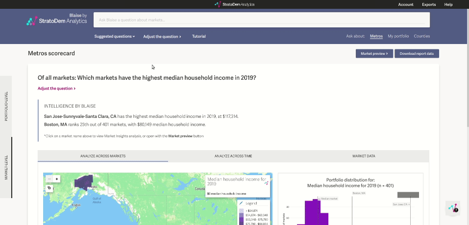

## `strato_query`
Tools to help query the StratoDem Analytics API for economic and geo-demographic data in Python

[Back to main page](/)

## Table of contents
- [Installation and usage](#installation-and-usage)
- [Authentication](#authentication)
- [Sample queries](#sample-queries)
  - [Median household income for 80+ households across the US, by year](#median-household-income-for-80-households-across-the-us-by-year)
  - [Population density in the Boston MSA](#population-density-in-the-boston-msa)
  - [Population within five miles of latitude-longitude pair](#population-within-five-miles-of-latitude-longitude-pair)
- [Creating queries with Portfolio](#portfolio-query)

### [Installation and usage](#installation-and-usage)

Queries can be made from the command line (or from any environment that allows for sending POST requests).

### [Authentication](#authentication)
The StratoDem Analytics API requires an API token for authentication to be sent in the request body
```json
{
    "token": "my-api-token",
    "query": {}
}
```

[How do I create a new API token or find an existing token? &rarr;](https://academy.stratodem.com/article/82-creating-and-managing-api-tokens)

### [Sample queries](#sample-queries)

#### [Median household income for 80+ households across the US, by year](#median-household-income-for-80-households-across-the-us-by-year)
Submit a POST request with the following json content:
```json
{
    "token": "my-api-token",
    "query": {
        "query_type": "MEDIAN",
        "data_fields": [
            "year",
            {
                "median_value": "median_income"
            }
        ],
        "table": "incomeforecast_us_annual_income_group_age",
        "groupby": [
            "year"
        ],
        "data_filters": [
            {
                "filter_type": "ge",
                "filter_value": 17,
                "filter_variable": "age_g"
            },
            {
                "filter_type": "between",
                "filter_value": [
                    2010,
                    2013
                ],
                "filter_variable": "year"
            }
        ],
        "aggregations": [],
        "order": [
            "year"
        ],
        "median_variable_name": "income_g"
    }
}
```

For example:
```bash
$ curl -X POST "https://api.stratodem.com/api" -H "accept: application/json" -H "Content-Type: application/json" -d "{ \"token\": \"my-api-token\", \"query\": { \"query_type\": \"MEDIAN\", \"data_fields\": [ \"year\", { \"median_value\": \"median_income\" } ], \"table\": \"incomeforecast_us_annual_income_group_age\", \"groupby\": [ \"year\" ], \"data_filters\": [ { \"filter_type\": \"ge\", \"filter_value\": 17, \"filter_variable\": \"age_g\" }, { \"filter_type\": \"between\", \"filter_value\": [ 2010, 2013 ], \"filter_variable\": \"year\" } ], \"aggregations\": [], \"order\": [ \"year\" ], \"median_variable_name\": \"income_g\"}}"
```

Response body:
```json
{
  "success": true,
  "data": [
    {
      "year": 2010,
      "median_income": 27645
    },
    {
      "year": 2011,
      "median_income": 29269
    },
    {
      "year": 2012,
      "median_income": 30474
    },
    {
      "year": 2013,
      "median_income": 30712
    }
  ],
  "message": "Query executed"
}
```

#### [Population density in the Boston MSA](#population-density-in-the-boston-msa)
Submit a POST request with the following json content:
```json
{
    "token": "my-api_token",
    "query": {
        "query_type": "COUNT",
        "data_fields": [
            "year",
            "cbsa",
            {
                "population": "population"
            }
        ],
        "table": "populationforecast_metro_annual_population",
        "groupby": [
            "cbsa",
            "year"
        ],
        "data_filters": [
            {
                "filter_type": "lt",
                "filter_value": 2015,
                "filter_variable": "year"
            },
            {
                "filter_type": "eq",
                "filter_value": 14454,
                "filter_variable": "cbsa"
            }
        ],
        "aggregations": [
            {
                "aggregation_func": "sum",
                "variable_name": "population"
            }
        ],
        "join": {
            "query_type": "AREA",
            "data_fields": [
                "cbsa",
                "area",
                "name"
            ],
            "table": "geocookbook_metro_na_shapes_full",
            "groupby": [
                "cbsa",
                "name"
            ],
            "data_filters": [
                {
                    "filter_type": "eq",
                    "filter_value": 14454,
                    "filter_variable": "cbsa"
                }
            ],
            "aggregations": [],
            "on": {
                "left": [
                    "cbsa"
                ],
                "right": [
                    "cbsa"
                ]
            }
        },
        "order": [
            "year"
        ]
    }
}
```

For example:
```bash
$ curl -X POST "https://api.stratodem.com/api" -H "accept: application/json" -H "Content-Type: application/json" -d "{ \"token\": \"my-api-token\", \"query\": { \"query_type\": \"COUNT\", \"data_fields\": [ \"year\", \"cbsa\", { \"population\": \"population\" } ], \"table\": \"populationforecast_metro_annual_population\", \"groupby\": [ \"cbsa\", \"year\" ], \"data_filters\": [ { \"filter_type\": \"lt\", \"filter_value\": 2015, \"filter_variable\": \"year\" }, { \"filter_type\": \"eq\", \"filter_value\": 14454, \"filter_variable\": \"cbsa\" } ], \"aggregations\": [ { \"aggregation_func\": \"sum\", \"variable_name\": \"population\" } ], \"join\": { \"query_type\": \"AREA\", \"data_fields\": [ \"cbsa\", \"area\", \"name\" ], \"table\": \"geocookbook_metro_na_shapes_full\", \"groupby\": [ \"cbsa\", \"name\" ], \"data_filters\": [ { \"filter_type\": \"eq\", \"filter_value\": 14454, \"filter_variable\": \"cbsa\" } ], \"aggregations\": [], \"on\": { \"left\": [ \"cbsa\" ], \"right\": [ \"cbsa\" ] } }, \"order\": [ \"year\" ]}}"
```

Response body:
```json
{
  "success": true,
  "data": [
    {
      "year": 2000,
      "cbsa": 14454,
      "population": 1817813.37106603,
      "name": "Boston, MA",
      "area": 1182.6550790958
    },
    {
      "year": 2001,
      "cbsa": 14454,
      "population": 1831663.45762375,
      "name": "Boston, MA",
      "area": 1182.6550790958
    },
    {
      "year": 2002,
      "cbsa": 14454,
      "population": 1837357.39669445,
      "name": "Boston, MA",
      "area": 1182.6550790958
    },
    {
      "year": 2003,
      "cbsa": 14454,
      "population": 1834429.41429485,
      "name": "Boston, MA",
      "area": 1182.6550790958
    },
    {
      "year": 2004,
      "cbsa": 14454,
      "population": 1828984.37549513,
      "name": "Boston, MA",
      "area": 1182.6550790958
    },
    {
      "year": 2005,
      "cbsa": 14454,
      "population": 1824502.31380532,
      "name": "Boston, MA",
      "area": 1182.6550790958
    },
    {
      "year": 2006,
      "cbsa": 14454,
      "population": 1827464.31943664,
      "name": "Boston, MA",
      "area": 1182.6550790958
    },
    {
      "year": 2007,
      "cbsa": 14454,
      "population": 1838273.38312452,
      "name": "Boston, MA",
      "area": 1182.6550790958
    },
    {
      "year": 2008,
      "cbsa": 14454,
      "population": 1854347.40485414,
      "name": "Boston, MA",
      "area": 1182.6550790958
    },
    {
      "year": 2009,
      "cbsa": 14454,
      "population": 1875325.42426922,
      "name": "Boston, MA",
      "area": 1182.6550790958
    },
    {
      "year": 2010,
      "cbsa": 14454,
      "population": 1894379.35079246,
      "name": "Boston, MA",
      "area": 1182.6550790958
    },
    {
      "year": 2011,
      "cbsa": 14454,
      "population": 1912755.37366465,
      "name": "Boston, MA",
      "area": 1182.6550790958
    },
    {
      "year": 2012,
      "cbsa": 14454,
      "population": 1932278.37336501,
      "name": "Boston, MA",
      "area": 1182.6550790958
    },
    {
      "year": 2013,
      "cbsa": 14454,
      "population": 1952785.34127759,
      "name": "Boston, MA",
      "area": 1182.6550790958
    },
    {
      "year": 2014,
      "cbsa": 14454,
      "population": 1970099.38892979,
      "name": "Boston, MA",
      "area": 1182.6550790958
    }
  ],
  "message": "Query executed"
}
```

### [Population within five miles of latitude-longitude pair](#population-within-five-miles-of-latitude-longitude-pair)
Submit a POST request with the following json content:
```json
{
    "token": "my-api-token",
    "query": {
        "query_type": "COUNT",
        "data_fields": [
            "YEAR",
            {
                "population": "population_within_5_miles"
            }
        ],
        "table": "populationforecast_tract_annual_population",
        "groupby": [
            "year"
        ],
        "data_filters": [
            {
                "filter_type": "mile_radius",
                "filter_value": {
                    "latitude": 40.75895,
                    "longitude": -73.9937,
                    "miles": 5
                },
                "filter_variable": ""
            },
            {
                "filter_type": "between",
                "filter_value": [
                    2010,
                    2020
                ],
                "filter_variable": "year"
            }
        ],
        "aggregations": [
            {
                "variable_name": "population",
                "aggregation_func": "sum"
            }
        ]
    }
}
```


For example:
```bash
$ curl -X POST "https://api.stratodem.com/api" -H "accept: application/json" -H "Content-Type: application/json" -d "{ \"token\": \"my-api-token\", \"query\": { \"query_type\": \"COUNT\", \"data_fields\": [ \"YEAR\", { \"population\": \"population_within_5_miles\" } ], \"table\": \"populationforecast_tract_annual_population\", \"groupby\": [ \"year\" ], \"data_filters\": [ { \"filter_type\": \"mile_radius\", \"filter_value\": { \"latitude\": 40.75895, \"longitude\": -73.9937, \"miles\": 5 }, \"filter_variable\": \"\" }, { \"filter_type\": \"between\", \"filter_value\": [ 2010, 2020 ], \"filter_variable\": \"year\" } ], \"aggregations\": [ { \"variable_name\": \"population\", \"aggregation_func\": \"sum\" } ]}}"
```

Response body:
```json
{
  "success": true,
  "data": [
    {
      "year": 2010,
      "population_within_5_miles": 2333543.76387307
    },
    {
      "year": 2011,
      "population_within_5_miles": 2369469.36267422
    },
    {
      "year": 2012,
      "population_within_5_miles": 2400244.89742903
    },
    {
      "year": 2013,
      "population_within_5_miles": 2420539.28767197
    },
    {
      "year": 2014,
      "population_within_5_miles": 2438205.5108905
    },
    {
      "year": 2015,
      "population_within_5_miles": 2456860.392675
    },
    {
      "year": 2016,
      "population_within_5_miles": 2469091.1292535
    },
    {
      "year": 2017,
      "population_within_5_miles": 2476177.54482405
    },
    {
      "year": 2018,
      "population_within_5_miles": 2498821.96926049
    },
    {
      "year": 2019,
      "population_within_5_miles": 2516820.09840416
    },
    {
      "year": 2020,
      "population_within_5_miles": 2536601.81249986
    }
  ],
  "message": "Query executed"
}
```

### [Creating queries with Portfolio](#portfolio-query)
#### Find the median home values by metro for adults 60+ in the year 2018

