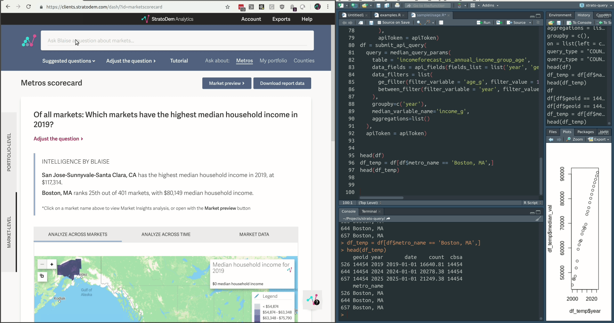
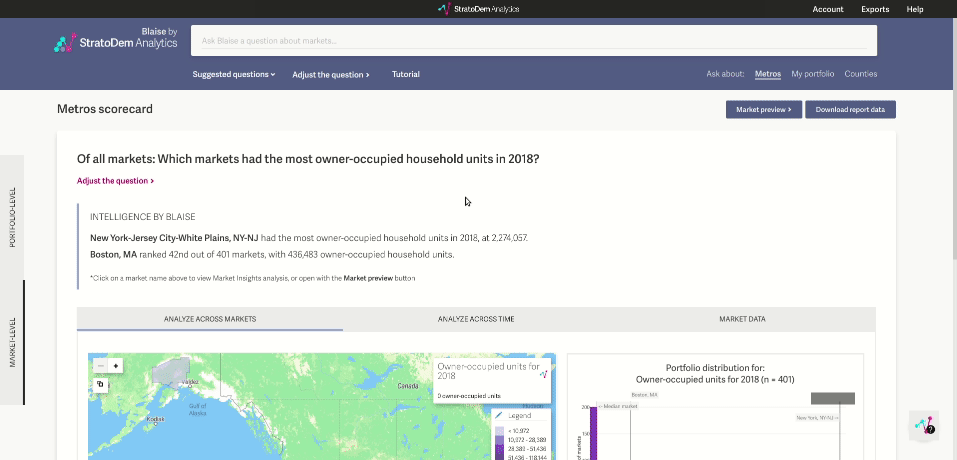

## `stRatoquery`
Tools to help query the StratoDem Analytics API for economic and geo-demographic data in R

[Back to main page](/)

## Table of contents
- [Installation and usage](#installation-and-usage)
- [Authentication](#authentication)
- [Sample queries](#sample-queries)
  - [Median household income for 80+ households across the US, by year](#median-household-income-for-80-households-across-the-us-by-year)
  - [Population density in the Boston MSA](#population-density-in-the-boston-msa)
  - [Population within five miles of latitude-longitude pair](#population-within-five-miles-of-latitude-longitude-pair)
- [Using Blaise ML to generate queries](#using-blaise-ml-to-generate-queries)

### [Installation and usage](#installation-and-usage)

To install the `stRatoquery` R package:
```R
library(devtools)
devtools::install_github('StratoDem/strato-query')
```

### [Authentication](#authentication)
`stRatoquery::submit_api_query` requires an `apiToken` argument.

[How do I create a new API token or find an existing token? &rarr;](https://academy.stratodem.com/article/82-creating-and-managing-api-tokens)

### [Sample queries](#sample-queries)

#### [Median household income for 80+ households across the US, by year](#median-household-income-for-80-households-across-the-us-by-year)
```R
library(stRatoquery)

# Finds median household income in the US for those 80+ from 2010 to 2013
df = submit_api_query(
  query = median_query_params(
    table = 'incomeforecast_us_annual_income_group_age',
    data_fields = api_fields(fields_list = list('year', list(median_value = 'median_hhi'))),
    data_filters = list(
        ge_filter(filter_variable = 'age_g', filter_value = 17),
        between_filter(filter_variable = 'year', filter_value = c(2010, 2013))
    ),
    groupby=c('year'),
    median_variable_name='income_g',
    aggregations=list()
  ),
  apiToken = apiToken)

print('Median US household income 80+:')
print(head(df))
```

Output:
```
[1] "Median US household income 80+:"
  year median_hhi
1 2010      27645
2 2011      29269
3 2012      30474
4 2013      30712
```

#### [Population density in the Boston MSA](#population-density-in-the-boston-msa)
```R
library(stRatoquery)

apiToken = 'my-api-token'

df = submit_api_query(
  query = api_query_params(
    table = 'populationforecast_metro_annual_population',
    data_fields = api_fields(fields_list = list('year', 'cbsa', list(population = 'population'))),
    data_filters = list(
        lt_filter(filter_variable = 'year', filter_value = 2015),
        eq_filter(filter_variable = 'cbsa', filter_value = 14454)
    ),
    groupby=c('year', 'cbsa'),
    aggregations = list(sum_aggregation(variable_name = 'population')),
    join = api_query_params(
        table = 'geocookbook_metro_na_shapes_full',
        query_type = 'AREA',
        data_fields = api_fields(fields_list = list('cbsa', 'area', 'name')),
        data_filters = list(),
        groupby = c('cbsa', 'name'),
        aggregations = list(),
        on = list(left = c('cbsa'), right = c('cbsa'))
    )
  ),
  apiToken = apiToken)

df$pop_per_sq_mi = df$population / df$area

print('Population density in the Boston MSA up to 2015:')
print(head(df))
print('Results truncated')
```

Output:
```
[1] "Population density in the Boston MSA up to 2015:"

  year  cbsa population       name     area pop_per_sq_mi
1 2014 14454    1970099 Boston, MA 1182.655      1665.828
2 2013 14454    1952785 Boston, MA 1182.655      1651.188
3 2012 14454    1932278 Boston, MA 1182.655      1633.848
4 2011 14454    1912755 Boston, MA 1182.655      1617.340
5 2010 14454    1894379 Boston, MA 1182.655      1601.802
6 2009 14454    1875325 Boston, MA 1182.655      1585.691

[1] "Results truncated"
```

### [Population within five miles of latitude-longitude pair](#population-within-five-miles-of-latitude-longitude-pair)
```R
library(stRatoquery)

df = submit_api_query(
  api_query_params(
    table = 'populationforecast_tract_annual_population',
    data_fields = api_fields(fields_list = list('YEAR', list(population = 'population_within_5_miles'))),
    data_filters = list(
      # Aggregate data within five miles of 40.7589, -73.9937
      mile_radius_filter(latitude = 40.7589, longitude = -73.9937, miles = 5),
      # Only get data for years between 2010 and 2020 (inclusive)
      between_filter(filter_variable = 'year', filter_value = c(2010, 2020))),
    aggregations = list(sum_aggregation(variable_name = 'population')),
    groupby = c('year')),
  apiToken = apiToken)

print('Population within five miles of 40.7589542, -73.9937348')
print(head(df))
```

Output:
```
[1] "Population within five miles of 40.7589542, -73.9937348"

  year population_within_5_miles
1 2010                   2331875
2 2011                   2367830
3 2012                   2398631
4 2013                   2418956
5 2014                   2436646
6 2015                   2455316
```

## [Using Blaise ML to generate queries](#using-blaise-ml-to-generate-queries)
Blaise ML by StratoDem Analytics is embedded in all StratoDem Analytics applications. One feature that Blaise ML supports is
generating the code for API queries from a natural language question in the [Portfolio application on clients.stratodem.com](https://clients.stratodem.com/dash/?id=marketscorecard).

To generate the code in R, just:
1. Type in the question to the text bar at the top of the application
2. Click **Adjust the question** to open the query adjustment drawer
3. Click **View API query** above the question in the drawer
4. Switch to the **R** tab and copy the generated API query/queries into your favorite R editor



#### Which metros have the most households with adults 65 to 79 with a net worth of at least $500,000 in 2019?

