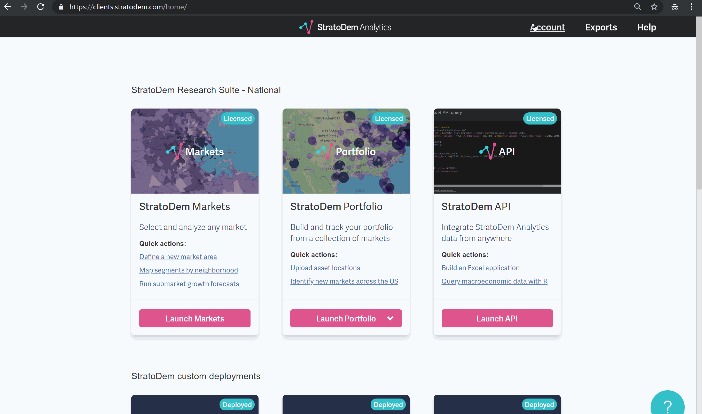
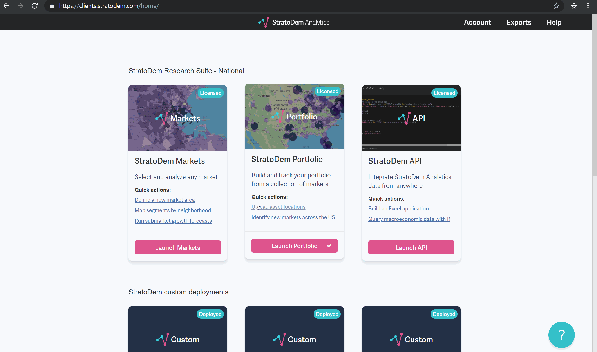
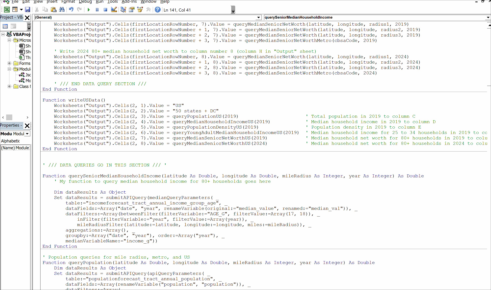
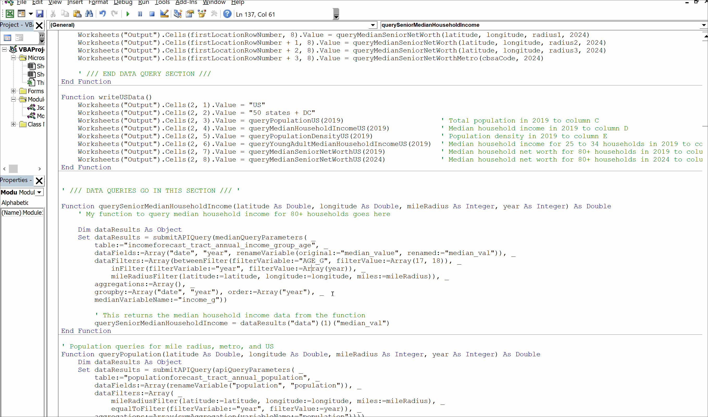
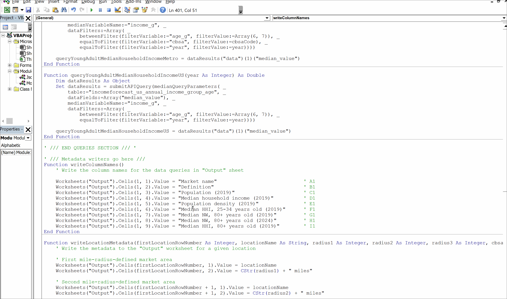

## StratoDem Analytics API for VBA in Excel
Tools to help query the StratoDem Analytics API for economic and
geo-demographic data using VBA in Excel

[Back to main page](/)

## Table of contents
- [Installation and usage](#installation-and-usage)
  - [Running the template the first time](#first-run)
  - [Editting the template to add a new query](#adding-a-query)
- [Sample queries](#sample-queries)
  - [Median household income for 80+ households across the US, by year](#median-household-income-for-80-households-across-the-us-by-year)
  - [Population within five miles of latitude-longitude pair](#population-within-five-miles-of-latitude-longitude-pair)
- [Using Blaise ML to generate queries](#using-blaise-ml-to-generate-queries)

### [Installation and usage](#installation-and-usage)

#### [Running the template the first time](#running-the-template-the-first-time)
1. Download API template ([download here](https://github.com/StratoDem/strato-query/raw/master/StratoDem_API_Template.xlsm))
2. Get an API token and place in the correct cell (`Configuration!B5`)
3. Select one to three buffers
4. Enter locations in the bottom section
5. Click RUN QUERIES

[How do I create a new API token or find an existing token? &rarr;](https://academy.stratodem.com/article/82-creating-and-managing-api-tokens)


#### [Editing the template to add a new query](#editing-the-template-to-add-a-new-query)
1. Request an API Excel template from the StratoDem Analytics team.
2. Get an API token and place in the correct cell, `B5` in the
   `Configuration` sheet of the Excel template
   ([How do I get an API token?](https://academy.stratodem.com/article/82-creating-and-managing-api-tokens)).
   
   

3. Enable the Developer tab in Excel. We'll come back here in a few
   steps
   ([How do I enable the Developer tab?](https://support.office.com/en-us/article/show-the-developer-tab-e1192344-5e56-4d45-931b-e5fd9bea2d45))
4. In a web browser, open
   [StratoDem Portfolio](https://clients.stratodem.com/dash?id=marketscorecard).
5. Load in a custom portfolio defined with mile radius markets
   ([How do I load in a portfolio?](https://academy.stratodem.com/article/43-loading-a-previously-defined-portfolio))
6. Ask Blaise: “Which markets have the highest median household income
   for 80+ households in 2019?”
   ([How do I ask Blaise a question?](https://academy.stratodem.com/article/53-ask-a-question))
7. Click **Adjust the question** to open the options drawer
   ([How do I adjust a query in StratoDem Portfolio?](https://academy.stratodem.com/article/54-adjust-the-question)).
8. Click the **View API query** button.
9. Click on the **Excel VBA** tab in the popup window. The code here
   includes the query objects necessary to replicate the query for each
   market definition in the entire portfolio. We’re only going to use
   one of them for now.
   
   

10. **In your Excel file**, open the Visual Basic editor from the
    Developer tab in the top ribbon. We’re going to modify the
    `writeLocationData` VBA function to add a column for median
    household income for households age 80+ in 2019.
11. Create a new function (ours will be called
    `querySeniorMedianHouseholdIncome`) like this: 
    ```vba
    Function querySeniorMedianHouseholdIncome(latitude As Double, longitude As Double, mileRadius As Integer, year As Integer) As Double
        ' Query median household income for households age 80+
        ' for a market defined by latitude, longitude and mileRadius
        
    End Function
    ```
    
    

12. From the Portfolio app, copy the first query section into that new
    function below the comments.
    
    

13. Edit two of the filters to be sure we're requesting the right data:
    1. The **year filter** to be the `year` passed in as an argument to
       the function: 
       ```vba
       inFilter(filterValue:="year", filterValue:=year)
       ```
    2. The mile radius filter to use `latitude`, `longitude`, and
       `mileRadius` passed in as arguments to the function:
       ```vba
       mileRadiusFilter(latitude:=latitude, longitude:=longitude, miles:=mileRadius)
       ```
    The query will now ask for data to be restricted to the
    mile-radius-defined market area in the `year` we pass to the
    function.
14. To have the function return a value, we need to add one final line
    to the end of the function:
    ```vba
    querySeniorMedianHouseholdIncome = dataResults("data")(1)("median_val")
    ```
    Make sure that, if you use a different query, `"median_val"` is
    whatever the target metric is named in the query object (for
    example, it might be `"households"` instead. 
    
    

15.  Add a code block to the `writeLocationData` function that calls our
     new `querySeniorMedianHouseholdIncome` function and writes the data
     (make sure to use a new column index number) 
     ```vba 
     ' Write senior median household income (age 80+)
     Worksheets("Output").Cells(firstLocationRowNumber, 9).Value = querySeniorMedianHouseholdIncome(latitude, longitude, radius1, 2019) 
     Worksheets("Output").Cells(firstLocationRowNumber + 1, 9).Value = querySeniorMedianHouseholdIncome(latitude, longitude, radius2, 2019) 
     Worksheets("Output").Cells(firstLocationRowNumber + 2, 9).Value = querySeniorMedianHouseholdIncome(latitude, longitude, radius3, 2019)
     ```

16. Update the `writeColumnMetadata` function to add a new column name:
    ```vba
    Worksheets("Output").Cells(1, 9).Value = "Median household income 80+ households (2019)" ' I1
    ```
    
    

17. Now we need to add one more row for the associated metropolitan
    area. In StratoDem Portfolio, change the geographic coverage level
    in Portfolio to **Metro**
18. Open up the **View API** dialog again and we’ll copy the new code
    from the **Excel VBA** tab once more. The code here includes the
    query object necessary to replicate the query for all metros.
    
    

19. Back in Excel, open up the Visual Basic editor
20. Create a new function that we'll use to get the metro data (ours
    will be called `querySeniorMedianHouseholdIncomeMetro`) like this:
    
    ```vba
    Function querySeniorMedianHouseholdIncomeMetro(cbsaCode As Long, year As Integer) As Double
        ' Query median household income for households age 80+
        ' for a metro
        
    End Function
    ```
    
    

21. From the Portfolio app, copy the first query section into that new
    VBA function
    
    

22. Edit:
    1. The **year filter** to be the `year` passed in as an argument to
       the function: 
       ```vba
       inFilter(filterValue:="year", filterValue:=year)
       ```
    2. Add one more filter to restrict the data to the metro ID number
       passed in to the function:
        ```vba
        equalToFilter(filterVariable:=”cbsa”, filterValue:=cbsaCode)
        ```
        This makes sure we’re only getting data for the target metro
        area.
23. To have the function return a value, we need to add one final line to
    the end of the function:
 
    ```vba
    querySeniorMedianHouseholdIncomeMetro = dataResults("data")(1)("median_val")
    ```
    
    Again, make sure that, if you use a different query, `"median_val"`
    is whatever the target metric is named in the query object (for
    example, it might be `"households"` instead.
    
    

24. Add one more line of code to the `writeLocationData` below where we 
    wrote our previous new query calls for mile-radius-defined market
    areas:
 
    ```vba
    Worksheets("Output").Cells(firstLocationRowNumber + 3, 9).Value = querySeniorMedianHouseholdIncomeMetro(cbsaCode, 2019)
    ```
    
    

25. Click the **RUN QUERY** button in the `Configuration` sheet to query
    the data from the StratoDem Analytics API!
    
    

### [Sample queries](#sample-queries)

#### [Median household income for 80+ households across the US, by year](#median-household-income-for-80-households-across-the-us-by-year)
```VBA
' Finds median household income in the US for those 80+ from 2010 to 2013
Dim medianHHIQuery As Dictionary

Set medianHHIQuery = medianQueryParameters( _
    table:="incomeforecast_us_annual_income_group_age", _
    dataFields:=Array("year", renameVariable(original:="median_value", renamed:="median_income")), _
    dataFilters:=Array( _
        greaterThanFilter(filterVariable:="age_g", filterValue:=17), _
        betweenFilter(filterVariable:="year", filterValue:=Array(2010, 2013))), _
    groupby:=Array("year"), _
    medianVariableName:="income_g", _
    aggregations:=Array())

' Write the results to "US_median_household_income" (note that this sheet will need to exist first)
Call writeToSheet(results:=submitAPIQuery(medianHHIQuery), sheetName:="US_median_household_income")
```

Output:


### [Population within five miles of latitude-longitude pair](#population-within-five-miles-of-latitude-longitude-pair)
```VBA
' Gets population within five miles of 40.7589, -73.9937
Dim populationQuery As Dictionary

Set populationQuery = apiQueryParameters( _
    table:="populationforecast_tract_annual_population", _
    dataFields:=Array("year", renameVariable(original:="population", renamed:="population_within_5_miles")), _
    dataFilters:=Array( _
        mileRadiusFilter(latitude:=40.7589, longitude:=-73.9937, miles:=5), _
        betweenFilter(filterVariable:="year", filterValue:=Array(2010, 2020))), _
    groupby:=Array("year"), _
    aggregations:=Array(sumAggregation(variableName:="population")))

' Write the results to "Population_within_five_miles" (note that this sheet will need to exist first)
Call writeToSheet(results:=submitAPIQuery(populationQuery), sheetName:="Population_within_five_miles")
```

Output:


## [Using Blaise ML to generate queries](#using-blaise-ml-to-generate-queries)
Blaise ML by StratoDem Analytics is embedded in all StratoDem Analytics applications. One feature that Blaise ML supports is
generating the code for API queries from a natural language question in the [Portfolio application on clients.stratodem.com](https://clients.stratodem.com/dash/?id=marketscorecard).

To generate the code in VBA, just:
1. Type in the question to the text bar at the top of the application
2. Click **Adjust the question** to open the query adjustment drawer
3. Click **View API query** above the question in the drawer
4. Switch to the **VBA** tab and copy the generated API query/queries into your favorite R editor

#### Find the estimated household count by metro for adults ages 80+ and net worth of at least $100,000 in 2020  

