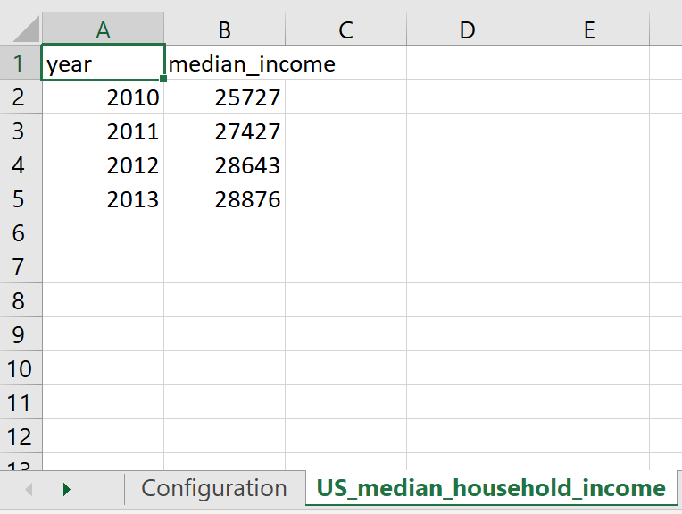
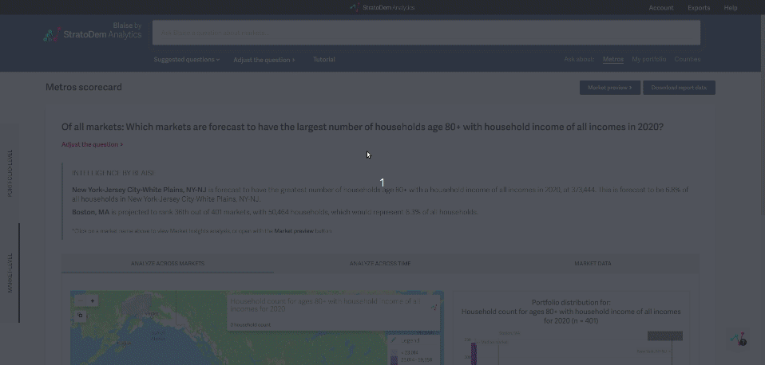

## StratoDem Analytics for Excel in VBA
Tools to help query the StratoDem Analytics API for economic and geo-demographic data using VBA in Excel

[Back to main page](/)

## Table of contents
- [Installation and usage](#installation-and-usage)
- [Authentication](#authentication)
- [Sample queries](#sample-queries)
  - [Median household income for 80+ households across the US, by year](#median-household-income-for-80-households-across-the-us-by-year)
  - [Population within five miles of latitude-longitude pair](#population-within-five-miles-of-latitude-longitude-pair)
- [Using Blaise ML to generate queries](#using-blaise-ml-to-generate-queries)

### [Installation and usage](#installation-and-usage)

Download the sample Excel file with a macro that hits the StratoDem Analytics API
to query data around a latitude-longitude pair ([download here](https://github.com/StratoDem/strato-query/raw/master/StratoDem_API_Template.xlsm)).

### [Authentication](#authentication)
The VBA function `submitAPIQuery` looks for a StratoDem Analytics API token in `Configuration!B5`. Place a valid token in that cell to authenticate queries. Then click the **RUN QUERIES** button to run the example queries for the three latitude-longitude pairs and three mile radius definitions specified.

[How do I create a new API token or find an existing token? &rarr;](https://academy.stratodem.com/article/82-creating-and-managing-api-tokens)


### [Sample queries](#sample-queries)

#### [Median household income for 80+ households across the US, by year](#median-household-income-for-80-households-across-the-us-by-year)
```VBA
' Finds median household income in the US for those 80+ from 2010 to 2013
Dim medianHHIQuery As Dictionary

Set medianHHIQuery = medianQueryParameters( _
    table:="incomeforecast_us_annual_income_group_age", _
    dataFields:=Array("year", renameVariable(original:="median_value", renamed:="median_income")), _
    dataFilters:=Array( _
        greaterThanFilter(filterVariable:="age_g", filterValue:=17), _
        betweenFilter(filterVariable:="year", filterValue:=Array(2010, 2013))), _
    groupby:=Array("year"), _
    medianVariableName:="income_g", _
    aggregations:=Array())

' Write the results to "US_median_household_income" (note that this sheet will need to exist first)
Call writeToSheet(results:=submitAPIQuery(medianHHIQuery), sheetName:="US_median_household_income")
```

Output:



### [Population within five miles of latitude-longitude pair](#population-within-five-miles-of-latitude-longitude-pair)
```VBA
' Gets population within five miles of 40.7589, -73.9937
Dim populationQuery As Dictionary

Set populationQuery = apiQueryParameters( _
    table:="populationforecast_tract_annual_population", _
    dataFields:=Array("year", renameVariable(original:="population", renamed:="population_within_5_miles")), _
    dataFilters:=Array( _
        mileRadiusFilter(latitude:=40.7589, longitude:=-73.9937, miles:=5), _
        betweenFilter(filterVariable:="year", filterValue:=Array(2010, 2020))), _
    groupby:=Array("year"), _
    aggregations:=Array(sumAggregation(variableName:="population")))

' Write the results to "Population_within_five_miles" (note that this sheet will need to exist first)
Call writeToSheet(results:=submitAPIQuery(populationQuery), sheetName:="Population_within_five_miles")
```

Output:


## [Using Blaise ML to generate queries](#using-blaise-ml-to-generate-queries)
Blaise ML by StratoDem Analytics is embedded in all StratoDem Analytics applications. One feature that Blaise ML supports is
generating the code for API queries from a natural language question in the [Portfolio application on clients.stratodem.com](https://clients.stratodem.com/dash/?id=marketscorecard).

To generate the code in VBA, just:
1. Type in the question to the text bar at the top of the application
2. Click **Adjust the question** to open the query adjustment drawer
3. Click **View API query** above the question in the drawer
4. Switch to the **VBA** tab and copy the generated API query/queries into your favorite R editor

#### Find the estimated household count by metro for adults ages 80+ and net worth of at least $100,000 in 2020  

