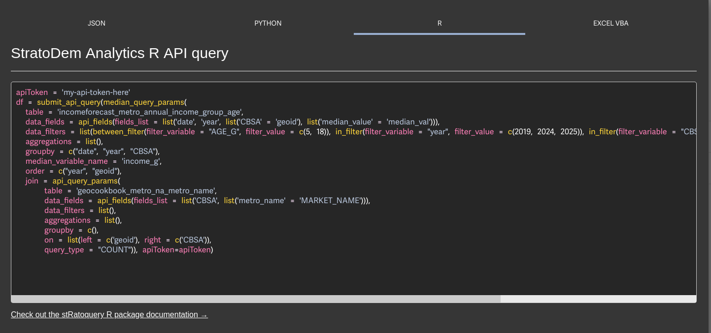

## StratoDem Analytics API packages
Tools to help query the StratoDem Analytics API for economic and geo-demographic data in
Excel, R, Python, and by HTTP request.

### Choose a language/setup:
- [Excel (VBA)](https://code.stratodem.com/?vb#introduction)
- [R](https://code.stratodem.com/?r#introduction)
- [Python](https://code.stratodem.com/?python#introduction)
- [curl / POST request](https://code.stratodem.com/?shell#introduction)
