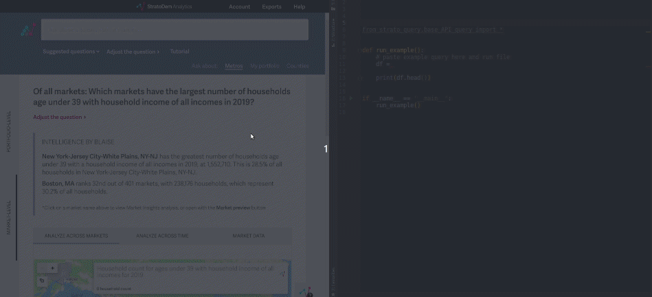

## `strato_query`
Tools to help query the StratoDem Analytics API for economic and geo-demographic data in Python

[Back to main page](/)

## Table of contents
- [Installation and usage](#installation-and-usage)
- [Authentication](#authentication)
- [Sample queries](#sample-queries)
  - [Median household income for 80+ households across the US, by year](#median-household-income-for-80-households-across-the-us-by-year)
  - [Population density in the Boston MSA](#population-density-in-the-boston-msa)
  - [Population within five miles of latitude-longitude pair](#population-within-five-miles-of-latitude-longitude-pair)
- [Using Blaise ML to generate queries](#using-blaise-ml-to-generate-queries)

### [Installation and usage](#installation-and-usage)

To install the `strato_query` Python package:
```
$ pip install strato-query
```

### [Authentication](#authentication)
`strato_query` looks for an `API_TOKEN` environment variable.
```bash
# Example passing a StratoDem Analytics API token to a Python file using the API
$ API_TOKEN=my-api-token-here python examples/examples.py
```

You can also create it at the start of a Python script:
```python
import os

# Set API_TOKEN environment variable to 'my-api-token'
os.environ['API_TOKEN'] = 'my-api-token'

# API calls from this point on will now query the API with API_TOKEN
```

[How do I create a new API token or find an existing token? &rarr;](https://academy.stratodem.com/article/82-creating-and-managing-api-tokens)

### [Sample queries](#sample-queries)

#### [Median household income for 80+ households across the US, by year](#median-household-income-for-80-households-across-the-us-by-year)
```python
from strato_query.base_API_query import BaseAPIQuery, APIMedianQueryParams
from strato_query.standard_filters import GtrThanOrEqFilter, BetweenFilter


# Finds median household income in the US for those 80+ from 2010 to 2013
df = BaseAPIQuery.query_api_df(
    query_params=APIMedianQueryParams(
        query_type='MEDIAN',
        table='incomeforecast_us_annual_income_group_age',
        data_fields=('year', {'median_value': 'median_income'}),
        median_variable_name='income_g',
        data_filters=(
            GtrThanOrEqFilter(var='age_g', val=17).to_dict(),
            BetweenFilter(var='year', val=[2010, 2013]).to_dict(),
        ),
        groupby=('year',),
        order=('year',),
        aggregations=(),
    )
)

print('Median US household income 80+:')
print(df.head())
```

Output:
```
Median US household income 80+:
   MEDIAN_INCOME  YEAR
0          27645  2010
1          29269  2011
2          30474  2012
3          30712  2013
```

#### [Population density in the Boston MSA](#population-density-in-the-boston-msa)
```python
from strato_query.base_API_query import BaseAPIQuery, APIQueryParams
from strato_query.standard_filters import EqFilter, LessThanFilter


df = BaseAPIQuery.query_api_df(
    query_params=APIQueryParams(
        query_type='COUNT',
        table='populationforecast_metro_annual_population',
        data_fields=('year', 'cbsa', {'population': 'population'}),
        data_filters=(
            LessThanFilter(var='year', val=2015).to_dict(),
            EqFilter(var='cbsa', val=14454).to_dict(),
        ),
        aggregations=(dict(aggregation_func='sum', variable_name='population'),),
        groupby=('cbsa', 'year'),
        order=('year',),
        join=APIQueryParams(
            query_type='AREA',
            table='geocookbook_metro_na_shapes_full',
            data_fields=('cbsa', 'area', 'name'),
            data_filters=(EqFilter(var='cbsa', val=14454).to_dict(),),
            groupby=('cbsa', 'name'),
            aggregations=(),
            on=dict(left=('cbsa',), right=('cbsa',)),
        )
    )
)

df['POP_PER_SQ_MI'] = df['POPULATION'].div(df['AREA'])
df_final = df[['YEAR', 'NAME', 'POP_PER_SQ_MI']]

print('Population density in the Boston MSA up to 2015:')
print(df_final.head())
print('Results truncated')
```

Output:

```
Population density in the Boston MSA up to 2015:
   YEAR        NAME  POP_PER_SQ_MI
0  2014  Boston, MA    1665.827530
1  2013  Boston, MA    1651.187549
2  2012  Boston, MA    1633.847778
3  2011  Boston, MA    1617.340007
4  2010  Boston, MA    1601.802067
Results truncated
```

### [Population within five miles of latitude-longitude pair](#population-within-five-miles-of-latitude-longitude-pair)
```python
from strato_query.base_API_query import BaseAPIQuery, APIQueryParams
from strato_query.standard_filters import MileRadiusFilter, BetweenFilter

df = BaseAPIQuery.query_api_df(
    query_params=APIQueryParams(
        table='populationforecast_tract_annual_population',
        data_fields=(('YEAR', {'population': 'population_within_5_miles'})),
        data_filters=(
            # Aggregate data within five miles of 40.7589542, -73.9937348
            MileRadiusFilter(
                latitude=40.75895, longitude=-73.9937, miles=5).to_dict(),
            # Only get data for years between 2010 and 2020 (inclusive)
            BetweenFilter(var='year', val=[2010, 2020]).to_dict()),
        aggregations=({'variable_name': 'population', 'aggregation_func': 'sum'},),
        groupby=('year',)))

print('Population within five miles of 40.7589542, -73.9937348')
print(df.head())
```

Output:
```
Population within five miles of 40.7589542, -73.9937348
   POPULATION_WITHIN_5_MILES  YEAR
0               2.333544e+06  2010
1               2.369469e+06  2011
2               2.400245e+06  2012
3               2.420539e+06  2013
4               2.438206e+06  2014
```

## [Using Blaise ML to generate queries](#using-blaise-ml-to-generate-queries)
Blaise ML by StratoDem Analytics is embedded in all StratoDem Analytics applications. One feature that Blaise ML supports is
generating the code for API queries from a natural language question in the [Portfolio application on clients.stratodem.com](https://clients.stratodem.com/dash/?id=marketscorecard).

To generate the code in Python, just:
1. Type in the question to the text bar at the top of the application
2. Click **Adjust the question** to open the query adjustment drawer
3. Click **View API query** above the question in the drawer
4. Switch to the **Python** tab and copy the generated API query/queries into your favorite R editor

#### Find the markets estimated to have the most adults 80+ in 2020

